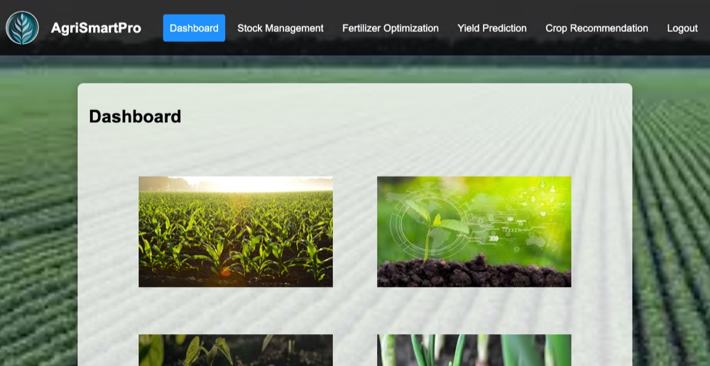
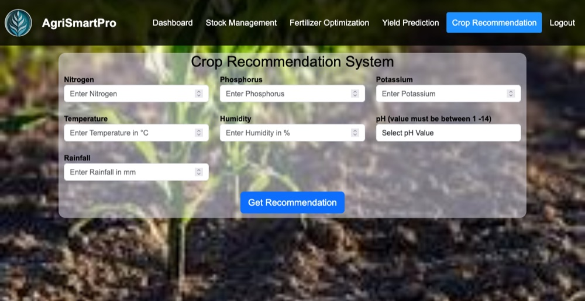

# AgriSmartPro

FYP ...  farm management project with two,
an Android app farmers use to track their crops and stock,
and a Python backend that recommends a crop, predicts a yield and suggests fertilizer from soil and weather figures.

FYP for BS SE at UOL, finished 2024 Sep.


## folders

```
android/    the mobile app, Kotlin
backend/    Flask server and the trained models
docs/       screenshots
```

The two halves ran separately. The app keeps its own data on the phone and
talks to Firebase and Gemini directly; the backend serves its own web pages for
the prediction tools and the lab dashboard.

## backend

Python 3.8 to 3.11. Not 3.12 or newer,saved models were
trained with scikit-learn 1.2.2.


```

### Pages

| `/` | landing page |
| `/index` | yield prediction form |
| `/index1` | crop recommendation form |
| `/fertilizer` | fertilizer advice form |
| `/Dashboard` | lab admin dashboard |
| `/StockManagement` | stock, backed by sqlite |






### The models

Three things predict,

Crop recommendation is a random forest over nitrogen, phosphorus, potassium,
temperature, humidity, pH and rainfall, and returns one of 22 crops. Trained in
`notebooks/Crop Recommendation.ipynb` on `Crop_recommendation.csv`, saved as
`model.pkl` with `standscaler.pkl` and `minmaxscaler.pkl`.


## android app

Open `android/` in Android Studio ,let it sync. Kotlin, minimum SDK 25,
targets 34, Gradle 8.7. Needs JDK 17.

 

The Gemini key is blank in `ui/notifications/NotificationsViewModel.kt`. Put
your own in to use the Agri AI tab; the rest of the app runs without it.

Google sign-in only works for a build signed with the key registered in the
Firebase project, so a debug build falls back to email and password.
