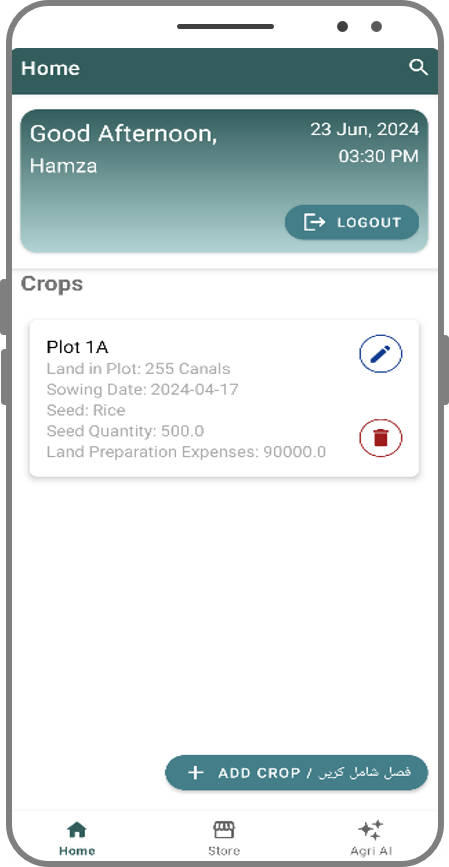
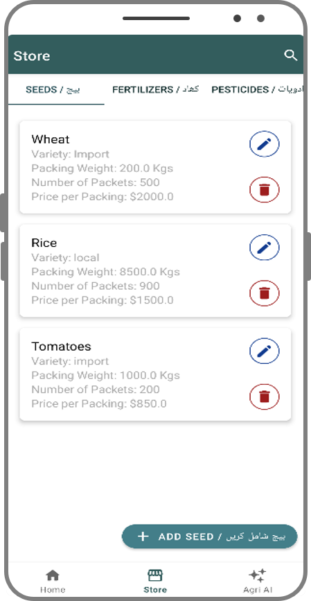
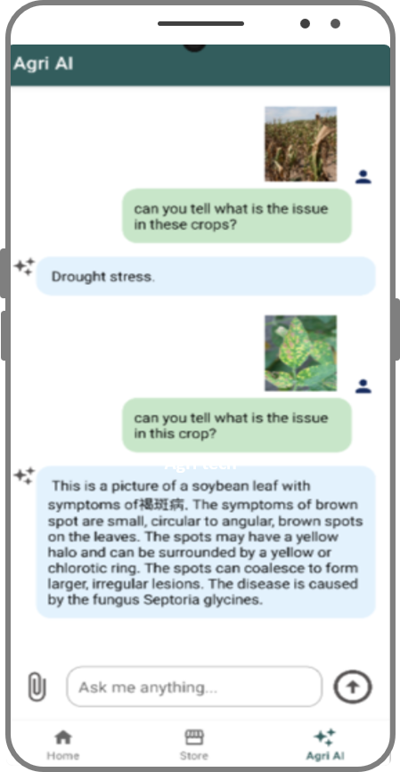

# AgriSmartPro

A farm management project with two halves: an Android app farmers use to track
their crops and stock, and a Python backend that recommends a crop, predicts a
yield and suggests fertilizer from soil and weather figures.

Final year project for BS Software Engineering at the University of Lahore,
finished in 2024. Built with Aymen Akram, supervised by Ms. Nadia Mushtaq
Gardazi.



## What's here

```
android/    the mobile app, Kotlin
backend/    Flask server and the trained models
docs/       the project report and screenshots
```

The two halves ran separately. The app keeps its own data on the phone and
talks to Firebase and Gemini directly; the backend serves its own web pages for
the prediction tools and the lab dashboard.

## The backend

Needs Python 3.8 to 3.11. Not 3.12 or newer, because the saved models were
trained with scikit-learn 1.2.2 and that version has no build for it.

```bash
git clone https://github.com/thehmzr/agrismartpro.git && cd agrismartpro
./run.sh
```

That builds a virtualenv under `backend/`, installs the dependencies and starts
the server on http://127.0.0.1:5000. Ctrl+C stops it. Run it again any time; it
skips whatever is already done.

```bash
./run.sh --port 8080   # different port
./run.sh --setup       # install but don't start
./run.sh --fresh       # rebuild the virtualenv
```

### Pages

| Path | What it does |
| --- | --- |
| `/` | landing page, sign in through Firebase |
| `/index` | yield prediction form |
| `/index1` | crop recommendation form |
| `/fertilizer` | fertilizer advice form |
| `/Dashboard` | lab admin dashboard |
| `/StockManagement` | stock table |

### The models

Three things predict, and each one loads from a pickle at startup.

Crop recommendation is a random forest over nitrogen, phosphorus, potassium,
temperature, humidity, pH and rainfall, and returns one of 22 crops. Trained in
`notebooks/Crop Recommendation.ipynb` on `Crop_recommendation.csv`, saved as
`model.pkl` with `standscaler.pkl` and `minmaxscaler.pkl`.

Yield prediction is a decision tree over rainfall, pesticide tonnage, average
temperature, country and crop, and returns hectograms per hectare. Trained in
`notebooks/Yield Prediction.ipynb` on `yield_df (1).csv`, saved as `dtr.pkl`
with `preprocessor .pkl`.

Fertilizer advice isn't learned. It reads `fertilizer.csv` for the crop's ideal
N, P and K, finds which of the three is furthest off, and returns the matching
write-up from `utils/fertilizer.py`.

The notebooks read their CSVs from alongside them, so start Jupyter inside
`backend/notebooks/`.

## The app

Open `android/` in Android Studio and let it sync. Kotlin, minimum SDK 25,
targets 34. Gradle 8.7.

Sign-in, registration and password reset go through Firebase Auth, with Google
sign-in alongside. Crops, seeds, fertilizers and pesticides live in a local
SQLite database, `AgriSmartPro.db`, set up in `DatabaseHelper.kt`. The Agri AI
tab sends a question, and optionally a photo of a crop, to Gemini and shows
what comes back.

 

The Gemini key is blank in `ui/notifications/NotificationsViewModel.kt`. Put
your own in to use the Agri AI tab; the rest of the app runs without it.

## The report

`docs/AgriSmartPro-FYP-Phase-II.pdf` is the phase II submission, 215 pages.
Requirements, use cases, the diagrams and the test cases.
